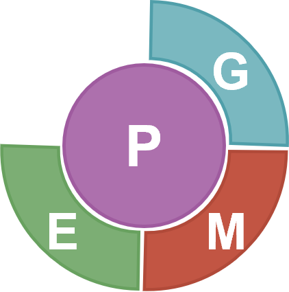

# HoloSimR

HoloSimR provides a valuable research platform, allowing researchers to test hypotheses and develop new approaches in a controlled in silico environment before applying them to real-world breeding programmes. This ultimately advances our understanding of host-microbiota interactions in the context of animal breeding.

## Instalation
Instalation of required package:

```r
install.packages("devtools")
```
Instalation of HoloSimR:

```r
devtools::install_github("Casto-Rebollo/HoloSimR")
```
## Citation
Cristina Casto-Rebollo, Ivan Pocrnic, Gregor Gorjanc, Noelia Ibáñez-Escriche. HoloSimR: a comprehensive framework for simulating breeding programs including the hologenome scenario, 08 November 2024, PREPRINT (Version 1) available at Research Square [DOI: 10.21203/rs.3.rs-5409986/v1](https://doi.org/10.21203/rs.3.rs-5409986/v1)
